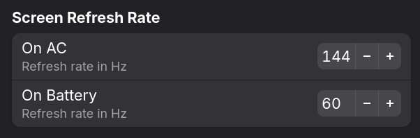

# Screen Refresh Rate Governor - GNOME Shell Extension


Automatically switch the screen refresh rate depending on the power supply status.



## Requirements

- GNOME Shell 48+

## Installation


### Manual Installation

1. **Download and install the extension files**

   ```sh
   git clone https://github.com/sasas991/gnome-refresh-rate-governor
   cd gnome-refresh-rate-governor
   make install
   ```
   Requires `git`, `make`, `jq`

2. **Restart GNOME Shell**

   Log out and log back in.

3. **Enable the extension**
   ```sh
   gnome-extensions enable refresh-rate-governor@sasas991.github.io
   ```

## Acknowledgments

This extension is a fork of [Screen Brightness Governor](https://github.com/inbalboa/gnome-brightness-governor) extension by [Serhiy Shliapuhin](https://github.com/inbalboa) adapted to the latest GNOME Shell version. 

## License

This project is licensed under the GPL-3.0 License - see the [LICENSE](LICENSE) file for details.
